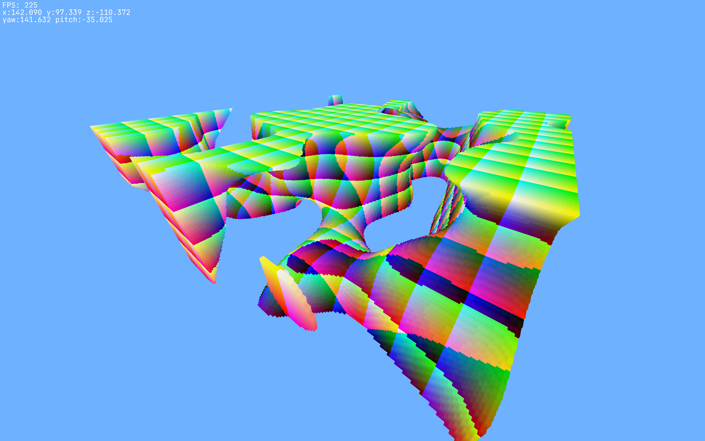

# Zig Voxel

A work-in-progress voxel engine in Zig (0.14.1 at time of writing). This is developed targeting Linux, but due to the nature of Zig being highly cross-platform, should be buildable for other platforms.

## Dependencies
The following are included in [build.zig.zon](./build.zig.zon) and are therefore automatically sourced:

- [zigglgen](https://github.com/castholm/zigglgen)  
OpenGL bindings generator
- [zig-glfw](https://github.com/falsepattern/zig-glfw)  
Zig GLFW bindings
- [mach-freetype](https://github.com/hexops/mach-freetype)  
Zig FreeType and HarfBuzz bindings
- [zm](https://github.com/griush/zm)  
SIMD Zig maths library
- [znoise](https://github.com/zig-gamedev/znoise?tab=readme-ov-file)  
Zig bindings for FastNoiseLite

## Roadmap
Currently still porting behaviour from [c-voxel](https://github.com/Samuel-Horner/c-voxel). Once done, this codebase will be focused on in future development.

Current Progress:
- Basic text rendering: DONE
- Player / Camera movement: DONE
- Core engine: DONE
- Chunk meshing and rendering: DONE
- World Generation: 25%
